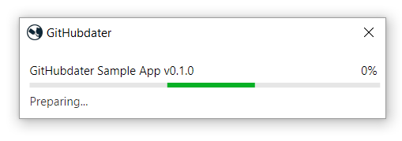

# GitHubdater

## Getting started
1. Obtain ([releases page](https://github.com/githubdater/githubdater/releases)) the updater executable and its configuration file (the update manifest)
2. Put these two files at the root of the application you want to update automatically
3. Edit the update manifest (XML) with appropriate values (instructions provided within the file, example [here](https://github.com/githubdater/githubdater/blob/master/githubdater-app/github.manifest.xml))
4. Call the updater executable within your application (any language) when you want to update it (typically at launch time, example [here](https://github.com/githubdater/sample-app/blob/master/githubdater-sample-app/Program.cs))

## Command line usage

### Synopsis
**githubdater.exe** **[ -p**=32768 **]** **[ -f**=myApp.exe **]** **[ -u**=custom.manifest  **-t**=github **]**

### Options
`-p`, `--initiating-process-pid`

&nbsp;&nbsp;&nbsp;&nbsp;Specify the pid of the process to kill to be able to update the application files

`-f`, `--follow-up-process-path`

&nbsp;&nbsp;&nbsp;&nbsp;Specify path of the application's executable to launch after the update. This path can be absolute or relative to the **githubdater** executable.

`-u`, `--update-manifest-name`

&nbsp;&nbsp;&nbsp;&nbsp;Specify the update manifest name (with extension) if it's not the default one

`-t`, `--update-manifest-type`

&nbsp;&nbsp;&nbsp;&nbsp;Specify the update manifest type if its name does not follow the default conventions which are:

- `github.update.manifest` for a GitHub manifest
- `gitlab.update.manifest` for a GitLab manifest (not yet supported)

&nbsp;&nbsp;&nbsp;&nbsp;Allowed values for update type are:

- `github`
- `gitlab` (not yet supported)
